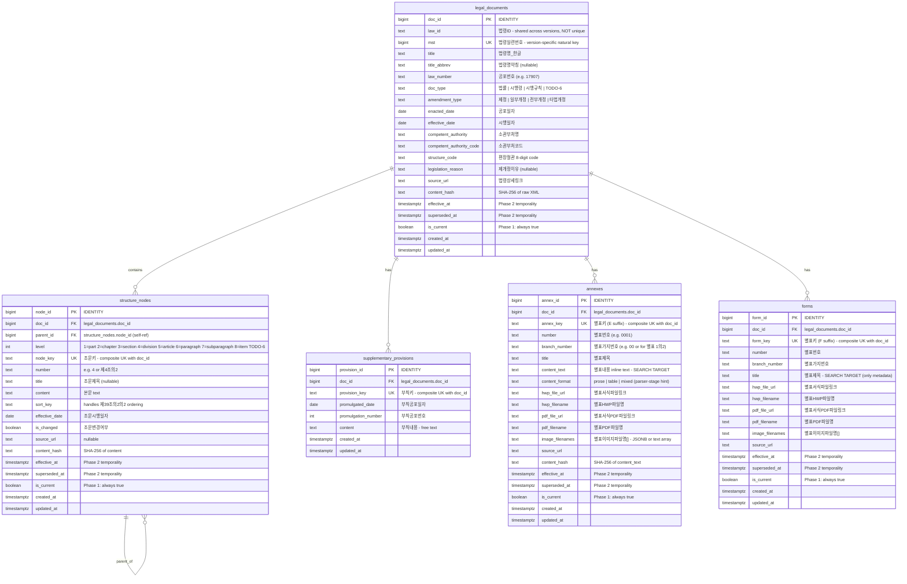

# Statute (성문규범) ERD Draft

> **Status**: Draft for human review
> **Scope**: Option B (Act + Enforcement Decree + Enforcement Rules + appendices/forms)
> **Basis**: earlier-session sketch (richer version) + law.go.kr XML analysis
> **Phase 1 domain**: 중대재해처벌법 (Serious Accidents Punishment Act)

---

## Confidence Markers

- ✅ Confirmed: agreed in earlier sessions or verified by XML
- 🔶 Agreed: decided by agreement before measurement
- ⚠️ Hypothesis: assumption, needs verification
- ❓ Open: requires a human decision

---

## ERD



### Context-only: chunks table (not part of this ERD)

The `chunks` table lives in a separate search-index layer. It references statute data via:

```
chunks.source_type = 'statute'
chunks.source_node_id → structure_nodes.node_id  (article body)
                       OR annexes.annex_id        (annex body)
                       -- forms are NOT a chunk source
```

**Forms are intentionally excluded from the search index.** Form bodies arrive as ASCII box-drawing text in `<별표내용>` — usable for display but actively harmful as retrieval input. Forms are reachable through metadata search (title, document_id) only.

This ERD must provide **stable identifiers** for chunks to back-reference.
See TODO-5 for retention policy.

---

## Entity Descriptions

### legal_documents

Represents a single statute document as a versioned unit. One row per law-version.

| Field | Confidence | Source / Rationale |
|-------|-----------|-------------------|
| `doc_id` | ✅ Resolved (TODO-4) | `BIGINT GENERATED ALWAYS AS IDENTITY`. Surrogate key. Single-column FK target for `chunks.source_id` |
| `law_id` | ✅ XML | `<법령ID>013993</법령ID>`. Identifies the law across versions — **not** in any UNIQUE constraint because multiple rows can share it once Phase 2 temporality is on |
| `mst` | ✅ Resolved (TODO-4) | `<법령일련번호>228817</법령일련번호>`. Version-specific natural key. **`UNIQUE` constraint** — drives idempotent upsert on re-ingestion |
| `title` | ✅ Sketch + XML | `<법령명_한글>` |
| `title_abbrev` | ✅ XML | `<법령명약칭>`. Present for this law ("중대재해처벌법"), nullable for others |
| `law_number` | ✅ Sketch + XML | `<공포번호>17907</공포번호>`. Official gazette number |
| `doc_type` | ✅ Sketch | Maps to `<법종구분>`. Enum values are TODO-6 |
| `amendment_type` | ✅ XML | `<제개정구분>제정</제개정구분>`. Not in original sketch but present in XML and needed for temporality tracking |
| `enacted_date` | ✅ Sketch + XML | `<공포일자>` |
| `effective_date` | ✅ XML | `<시행일자>`. Distinct from enacted_date (공포 vs 시행) |
| `competent_authority` | ✅ XML | `<소관부처>`. Text name of overseeing ministry |
| `competent_authority_code` | ✅ XML | `<소관부처 소관부처코드="1492000">`. For reliable joins |
| `structure_code` | ⚠️ XML | `<편장절관>09010000</편장절관>`. 8-digit code indicating which structural levels (편/장/절/관) the law uses. Encoding semantics not yet verified |
| `legislation_reason` | ⚠️ XML | `<제개정이유내용>`. Full text of the amendment rationale. Could be large. Whether to store inline or separately is a judgment call (see TODO-8 on JSONB) |
| `source_url` | 🔶 Agreed (CLAUDE.md) | Constructed from API link |
| `content_hash` | 🔶 Agreed (CLAUDE.md) | SHA-256 of raw XML for idempotent indexing (design principle #9) |
| `effective_at` | 🔶 Agreed | Temporality field. Phase 1: mirrors `effective_date`. Phase 2+: enables historical queries |
| `superseded_at` | 🔶 Agreed | Temporality field. Phase 1: null for all current rows |
| `is_current` | 🔶 Agreed | Phase 1: always `true` |
| `created_at`, `updated_at` | ✅ Auto-apply | Standard audit fields |

**Not stored (deliberate omissions)**:
- `연락부서` / `부서단위`: administrative contact info for each overseeing ministry. Not relevant to retrieval. Can be reconstructed from API if needed.
- `개정문내용`: the formal amendment text ("국회에서 의결된..."). Largely duplicates body + 부칙 content. Omitted for Phase 1.
- `법령명_한자`: identical to 한글 name for this law. May matter for older statutes. Deferred.

### structure_nodes

Represents a single node in the statute's hierarchical body. Self-referencing tree via `parent_id`.

| Field | Confidence | Source / Rationale |
|-------|-----------|-------------------|
| `node_id` | ✅ Resolved (TODO-4) | `BIGINT GENERATED ALWAYS AS IDENTITY`. Surrogate key. Stability across amendments is TODO-5 |
| `doc_id` | ✅ Resolved (TODO-4) | `BIGINT FK → legal_documents.doc_id`. Participates in the composite UK `(doc_id, node_key)` |
| `parent_id` | ✅ Sketch | `BIGINT FK` self-reference. Root nodes (편/장/조) have `parent_id = NULL` at top level. 항 → 조, 호 → 항, 목 → 호 |
| `level` | ✅ Sketch | Integer depth. Sketch defined 6 levels; XML reveals up to 8. Exact mapping is TODO-6 |
| `node_key` | ✅ Resolved (TODO-4) | `<조문단위 조문키="0004001">`. API-native identifier. **Composite `UNIQUE (doc_id, node_key)`** — same key value is reused across documents, so the doc_id scope is required |
| `number` | ✅ Sketch + XML | Article number as text. From `<조문번호>`, `<항번호>`, `<호번호>`, `<목번호>` depending on level |
| `title` | ✅ XML | `<조문제목>`. Only present on articles (level 5). e.g., "목적", "정의", "적용범위" |
| `content` | ✅ Sketch ("text") | Renamed from sketch's `text` to avoid SQL keyword collision. Contains `<조문내용>`, `<항내용>`, `<호내용>`, or `<목내용>` |
| `sort_key` | ✅ Sketch | For correct ordering. Handles irregular numbering like 제39조의2의2 |
| `effective_date` | ✅ XML | `<조문시행일자>`. Per-article effective date — can differ from the document-level date for amended articles |
| `is_changed` | ⚠️ XML | `<조문변경여부>`. Whether this article was modified in this version. Useful for amendment tracking |
| `source_url` | 🔶 Consistent | Nullable. For nodes that have a direct API link |
| `content_hash` | 🔶 Design principle #9 | For idempotent indexing at node level |
| `effective_at`, `superseded_at`, `is_current` | 🔶 Agreed | Same temporality pattern as legal_documents |
| `created_at`, `updated_at` | ✅ Auto-apply | Standard audit fields |

**XML field mapping for `조문여부`**:

The XML uses `<조문여부>` to distinguish structural headings from actual articles:

| 조문여부 value | Meaning | Mapped level | Example |
|---------------|---------|-------------|---------|
| `전문` | Chapter/section heading | 1~4 (depends on context) | "제1장 총칙" |
| `조문` | Actual article | 5 (article) | "제1조(목적)" |
| (no 조문여부) | Sub-article elements | 6~8 | 항, 호, 목 |

**Note on same-number duplication**: The same `조문번호` can appear twice — once as `전문` (heading, e.g., "제2장 중대산업재해") and once as `조문` (article). The `node_key` disambiguates: `0003000` (heading) vs `0003001` (article).

### supplementary_provisions

⚠️ **This table is not in the original sketch.** Added because 부칙 (supplementary provisions) is structurally distinct from the article hierarchy:

- Free-text CDATA blocks, not hierarchical 조 → 항 → 호 → 목
- Different key structure (`부칙키` ≠ `조문키`)
- Different metadata (promulgation-specific, no `level` or `sort_key`)

**Placement**: separate table — confirmed by ADR-004 (TODO-9, 2026-04-26).

**Chunk-source status**: **not** a chunk source in Phase 1 — ADR-005
(2026-04-26). Rows are persisted and SQL-queryable but not surfaced
through the hybrid retrieval pipeline. Reasoning: cross-law mention
pattern in 일부개정 부칙 (e.g., 도서관법, 화학물질관리법) creates
retrieval-poison; the 35804/35805 rows produce near-duplicate textual
diffs; even the high-value Act 제정 부칙 has within-row mixed signal
(시행일 + 다른 법률의 개정) that needs the deferred 부칙내용 parsing
decision to clean. Reversible — revisit on the explicit triggers in
ADR-005 ("Revisit triggers"). Trade-off: phased-enforcement carve-out
queries (e.g., "50인 미만 적용 시기") cannot be answered via free-text
search in Phase 1.

| Field | Confidence | Source / Rationale |
|-------|-----------|-------------------|
| `provision_id` | ✅ Resolved (TODO-4) | `BIGINT GENERATED ALWAYS AS IDENTITY` |
| `doc_id` | ✅ Resolved (TODO-4) | `BIGINT FK → legal_documents.doc_id`. Participates in composite UK `(doc_id, provision_key)` |
| `provision_key` | ✅ Resolved (TODO-4) | `<부칙단위 부칙키="2021012617907">`. **Composite `UNIQUE (doc_id, provision_key)`** |
| `promulgated_date` | ✅ XML | `<부칙공포일자>` |
| `promulgation_number` | ✅ XML | `<부칙공포번호>` |
| `content` | ✅ XML | `<부칙내용>`. Full text, may contain multiple articles (제1조, 제2조) in free-text form |
| `created_at`, `updated_at` | ✅ Auto-apply | Standard audit fields |

---

## Open Items (TODO)

### TODO-1: ✅ RESOLVED — split annexes and forms into separate tables

**Decision**: Option B from Seheon's framing — separate `annexes` and `forms` tables.

**Empirical basis** (verified by API inspection on 2026-04-25):

| Question | Finding |
|---------|---------|
| Are annexes inline text or attachment-only? | **Inline** — `<별표내용>` CDATA contains full text. HWP/PDF/GIF are supplementary |
| Are forms inline text or attachment-only? | **Inline too** — but body is ASCII box-drawing rendering of form layout |
| Is there a discriminator field? | Yes — `<별표구분>` with values `별표` (annex) / `서식` (form) |
| Is the 별표키 distinct? | Yes — annexes end in `E` (e.g., `000100E`), forms in `F` (e.g., `000100F`) |
| Phase 1 scope volumes | 중대재해처벌법 시행령: 5 별표, 0 서식. 산안법 시행규칙 (reference): 27 별표, 111 서식 |

**Refinement of Seheon's reasoning**:
- Original framing: "forms are blank templates — metadata is enough"
- Empirical reality: forms DO have body text, but it's ASCII box-art noise that hurts retrieval quality if indexed
- Conclusion: Option B stands. The reason for excluding form bodies is **retrieval quality**, not data absence

**Schema implications applied**:
- `annexes.content_text` populated from `<별표내용>` in Phase 1 — no HWP parsing needed
- `forms` has no `content_text` column — title and metadata only
- Both share file-attachment columns (HWP, PDF, image) for downstream display
- `chunks` source FK points to `annexes.annex_id` for annex chunks; forms are not a chunk source

**Related agreement**: DA #2 — appendices are part of the statute. phase-1-progress.md §2

### TODO-2: How to express Criminal Code references

**Current state**: undecided (DA #5, DA #11)
**Decision needed**: how to store cross-statute references (e.g., 중대재해처벌법 → 형법 specific articles)
**Options to consider**:
- A. Separate `cross_references` table — `(source_node_id, target_doc_id, target_node_id, reference_type)`. Explicit, queryable, enables graph traversal
- B. Metadata field on `structure_nodes` — JSONB array of referenced articles. Simpler but not queryable via FK
- C. Treat referenced Criminal Code articles as regular `legal_documents` + `structure_nodes` rows with a tag — no special reference mechanism, just co-existence in the same tables
- D. Combine A + C — store the Criminal Code articles in the same tables AND maintain explicit edges
**Information required to decide**:
- Complete T15: inventory of Criminal Code articles cited by the MoEL commentary
- Determine whether references are only from commentary (practical) or also from the statute body itself
- Assess retrieval impact: does the pipeline need to follow references, or just co-retrieve?
**Related agreement**: DA #5 and DA #11 in phase-1-progress.md §8

### TODO-3: Phase 1 ERD scope (D-1)

**Current state**: undecided. This ERD is produced under **Option B** (Act + Enforcement Decree + Enforcement Rules + appendices/forms)
**Decision needed**: confirm Option B, or choose A/C/D
**Options to consider**:
- A. Minimum: Act + Enforcement Decree + Enforcement Rules
- B. Medium: A + appendices and forms (current ERD assumes this)
- C. Wide: B + administrative regulations (notices, directives)
- D. Full: C + local ordinances and rules
**Information required to decide**:
- ✅ Verified 2026-04-25: 중대재해처벌법 has **no 시행규칙**. API search for "중대재해" returns only Act (MST=228817) + 시행령 (MST=277417). Phase 1 scope is therefore Act + 시행령 + appendices in 시행령
- Volume assessment: how many administrative regulations reference this law?
- Whether the `doc_type` enum and current table structure can accommodate C/D without schema changes (likely yes — just new enum values)
**Related agreement**: D-1 in phase-1-progress.md §6

### TODO-4: ✅ RESOLVED — `BIGINT IDENTITY` PK + natural-key `UNIQUE` (Option D)

**Decision**: every statute table uses `BIGINT GENERATED ALWAYS AS IDENTITY` as its primary key, with a separate `UNIQUE` constraint on the API-native natural key. Same strategy across all five tables (and forward-applied to future judicial / interpretive / practical / academic ERDs).

**Per-table specifics**:

| Table | PK | UNIQUE constraint | Natural-key source |
|-------|----|-------------------|--------------------|
| `legal_documents` | `doc_id BIGINT IDENTITY` | `UNIQUE (mst)` | `<법령일련번호>` |
| `structure_nodes` | `node_id BIGINT IDENTITY` | `UNIQUE (doc_id, node_key)` | `<조문단위 조문키>` |
| `supplementary_provisions` | `provision_id BIGINT IDENTITY` | `UNIQUE (doc_id, provision_key)` | `<부칙단위 부칙키>` |
| `annexes` | `annex_id BIGINT IDENTITY` | `UNIQUE (doc_id, annex_key)` | `<별표단위 별표키>` (E suffix) |
| `forms` | `form_id BIGINT IDENTITY` | `UNIQUE (doc_id, form_key)` | `<별표단위 별표키>` (F suffix) |

**Why D over A/B/C**:

1. **Idempotent ingestion (design principle #9)** — `INSERT … ON CONFLICT (mst) DO UPDATE …` is one statement per row. Options A and B (no natural UK) need a separate "find existing row" lookup, which is racier and more code.

2. **Single-column `chunks.source_id` (design principle #5)** — `chunks` references multiple source families (statute, judicial, interpretive, practical, academic). Mixed PK shapes per family would force `source_id` into a composite or text-encoded column. Uniform `BIGINT` keeps a single FK shape across all categories.

3. **pgvector index locality** — the chunks table will host the vector index. Sequential `BIGINT` joins stay buffer-cache-friendly; UUID v4 randomness fragments index reads. Negligible at Phase-1 scale, real at Phase-4.

4. **Reversible later** — adding an `external_uuid uuid UNIQUE` column on top of an existing `BIGINT` PK is non-destructive. Collapsing UUIDs into bigints later is not.

5. **Portfolio defensibility** — `BIGINT IDENTITY + natural UNIQUE` is the textbook idiomatic Postgres pattern. Reviewers parse it as competent and standard.

**Trade-off explicitly accepted**: PK values are not portable across DB rebuilds. Mitigation: the **natural key** is portable, so chunks-to-source linkage can always be re-derived via the UK after a rebuild. Chunks get rebuilt on every embedding refresh anyway, so `chunks.source_id` is never authoritative across rebuilds.

**Note on `legal_documents.law_id`**: deliberately *not* in any UNIQUE constraint. `law_id` (법령ID) is shared across versions of the same law and will collide once Phase 2 temporality is active. The version-specific identity is `mst`. When TODO-5 lands, a second UK such as `(law_id, effective_at)` may be added, but that is a TODO-5 concern.

**Related agreement**: design principle #9 (idempotent indexing), design principle #5 (multi-source by design)

### TODO-5: `node_id` retention policy across amendments

**Current state**: undecided
**Decision needed**: when a law is amended, do existing `structure_nodes` rows get updated in place or do we create new rows?
**Options to consider**:
- A. Immutable rows — each amendment creates new rows; old rows get `superseded_at` set. `node_id` is stable but version-specific. Chunks FK remains valid forever
- B. Update in place — same `node_id` is reused; content changes. Simpler but loses history; chunks point to current content only
- C. Hybrid — new row for content changes, same row for metadata-only changes. Complex but precise
**Information required to decide**:
- How frequently does 중대재해처벌법 get amended? (enacted 2021, Phase 1 domain)
- Whether the retrieval pipeline needs to answer "what did article X say on date Y?" (Phase 2+ temporality)
- Impact on chunks: if node_id changes on amendment, all chunks referencing the old node need re-indexing
**Related agreement**: design principle #4 (temporal-ready but not temporal-active), phase-1-progress.md §5

### TODO-6: Exact enum values for `doc_type` and `level`

**Current state**: undecided
**Decision needed**: finalize the enum sets

**`doc_type`** — values observed or expected:
- ✅ `법률` (Act) — confirmed in XML (`법종구분코드="A0002"`)
- ✅ `대통령령` (Presidential Decree / 시행령) — confirmed in XML
- ⚠️ `총리령` (Prime Minister Decree / 시행규칙) — expected but not yet observed for this law
- ⚠️ `부령` (Ministerial Decree / 시행규칙) — expected but not yet observed
- ❓ `행정규칙` (Administrative regulation) — only if scope expands to Option C/D
- ❓ `자치법규` (Local ordinance) — only if scope expands to Option D

**`level`** — the sketch defined 6 levels; the XML reveals up to 8:

| Level | Korean | XML element | Sketch mapping |
|-------|--------|------------|---------------|
| 1 | 편 (Part) | 조문여부=전문 | Sketch level 1 |
| 2 | 장 (Chapter) | 조문여부=전문 | Sketch level 1 (conflated) |
| 3 | 절 (Section) | 조문여부=전문 | Sketch level 2 |
| 4 | 관 (Division) | 조문여부=전문 | Not in sketch |
| 5 | 조 (Article) | 조문여부=조문 | Sketch level 3 |
| 6 | 항 (Paragraph) | `<항>` | Sketch level 4 |
| 7 | 호 (Subparagraph) | `<호>` | Sketch level 5 |
| 8 | 목 (Item) | `<목>` | Sketch level 6 |

**Note**: not all levels are used by every law. 중대재해처벌법 uses 장(2) → 조(5) → 항(6) → 호(7) → 목(8). No 편, 절, or 관.

**Information required to decide**:
- Whether to use integer levels or text enum (`'article'`, `'paragraph'`, etc.)
- Whether `doc_type` should be a PostgreSQL ENUM type, a CHECK constraint, or a reference table
**Related agreement**: phase-1-progress.md §5 (per-category source-structure design)

### TODO-7: Index strategy

**Current state**: undecided
**Decision needed**: which columns get B-tree indexes, partial indexes, or composite indexes
**Options to consider**:
- A. Minimal — PK + FK only (PostgreSQL creates these automatically for PK; FK indexes are manual)
- B. Retrieval-optimized — add indexes on `(doc_id, level)`, `(doc_id, sort_key)`, `is_current`, `doc_type`
- C. Deferred — add indexes based on measured query patterns after the retrieval pipeline is built
**Information required to decide**:
- Query patterns from the retrieval pipeline (not yet designed)
- Whether partial indexes on `is_current = true` are worthwhile (Phase 1: all rows are current)
**Related agreement**: design principle #13 (measure first, plan second) — favors Option C

### TODO-8: Use of JSONB fields

**Current state**: undecided for statute tables (agreed for `chunks.metadata`)
**Decision needed**: whether `legal_documents` or `structure_nodes` should have a JSONB `metadata` column for semi-structured data
**Options to consider**:
- A. No JSONB — all fields are explicit columns. Strict, type-safe, but rigid for unexpected API fields
- B. JSONB `metadata` on both tables — catch-all for fields not worth promoting to columns (e.g., `연락부서`, `법령명_한자`, `편장절관` details)
- C. JSONB only on `legal_documents` — document-level metadata is more variable; node-level metadata is well-structured
**Information required to decide**:
- Whether other law.go.kr API responses (other law types, other API versions) return fields not captured in the current schema
- Whether downstream consumers (retrieval pipeline, API responses) need to access these fields
**Related agreement**: chunks table uses JSONB `metadata` per phase-1-progress.md §5

### TODO-9: ✅ RESOLVED — keep `supplementary_provisions` as a separate table

**Decision**: Option A — `supplementary_provisions` stays as a separate
table, not merged into `structure_nodes`. See
`docs/decisions/ADR-004-supplementary-provisions-placement.md`.

**Why** (full argument in ADR-004):
- `<부칙단위>` carries `부칙공포일자` and `부칙공포번호` that have no
  analog on `<조문단위>`. Merging would force them nullable on every
  `structure_nodes` row — the same polymorphic-table pattern ADR-003
  rejected on the chunks side.
- Cardinality semantics differ: 조문 row count tracks current statute
  structure; 부칙단위 row count tracks amendment history (Decree:
  1 제정 + 5 일부개정 = 6 rows).
- Different retrieval intents — body-content queries vs effective-date
  queries — encode at the schema layer for free with two tables.

**Schema implications applied**: none — the current ERD draft already
reflects the separate-table shape. No column changes from this decision.

**Out of scope (future ADRs)**:
- Whether `supplementary_provisions` is a chunk source. ADR-003's DDL
  omits `provision_id`; the current implicit default is "not a chunk
  source," but that has not been argued explicitly. Provisional next
  ADR.
- How to internally parse `부칙내용` (제N조 inside the CDATA blob).
- Whether to add a `kind` column distinguishing 제정 부칙 vs 일부개정
  부칙 (coupled with the chunk-source question).

**Related agreement**: not in earlier sketch — raised by XML analysis on 2026-04-25, resolved 2026-04-26.

### TODO-10: Act-Decree linkage mechanism

**Current state**: not discussed in earlier sessions
**Decision needed**: how to express the relationship between a law (법률) and its enforcement decree (시행령) / rules (시행규칙)
**Options to consider**:
- A. No explicit FK — the relationship is implied by `title` naming convention ("X법 시행령" → parent is "X법"). Query via `LIKE` or text matching
- B. `parent_doc_id` FK on `legal_documents` — explicit self-reference. Act is root, Decree is child, Rules is grandchild
- C. Separate `document_relations` table — `(source_doc_id, target_doc_id, relation_type)`. More flexible, supports multiple relation types
**Information required to decide**:
- Whether the retrieval pipeline needs to "follow" delegation references to the decree (e.g., "제4조제2항의 구체적 사항은 대통령령으로 정한다" → fetch the relevant decree articles)
- Volume: how many decree articles are there per act article? (시행령 XML is 97KB vs act's 42KB — roughly 2:1)
**Related agreement**: requirement 4-2 (delegation phrases), phase-1-progress.md §10 (next session considerations)

---

## Differences from the Earlier-Session Sketch

### Added fields (derived from XML)

| Entity | Field | Reason |
|--------|-------|--------|
| `legal_documents` | `law_id` | API provides `법령ID` as a stable cross-version identifier. Not in sketch |
| `legal_documents` | `mst` | API provides `법령일련번호` as a version-specific identifier. Not in sketch |
| `legal_documents` | `title_abbrev` | API provides `법령명약칭`. Useful for display and search |
| `legal_documents` | `amendment_type` | API provides `제개정구분`. Needed for temporality tracking |
| `legal_documents` | `effective_date` | Distinct from `enacted_date`. 공포일자 ≠ 시행일자 (e.g., enacted 2021-01-26, effective 2022-01-27) |
| `legal_documents` | `competent_authority` / `_code` | API provides 소관부처. Useful for filtering |
| `legal_documents` | `structure_code` | API provides 편장절관 code. Determines which structural levels exist |
| `legal_documents` | `legislation_reason` | API provides 제개정이유. Large text; storage approach is TODO-8 |
| `structure_nodes` | `doc_id` FK | Implicit in sketch (nodes belong to a document) but not explicit |
| `structure_nodes` | `node_key` | API's native identifier (조문키). Enables re-fetch and provenance tracking |
| `structure_nodes` | `title` | API provides 조문제목 (e.g., "목적", "정의"). Not in sketch |
| `structure_nodes` | `effective_date` | Per-article 조문시행일자. Can differ from document-level date |
| `structure_nodes` | `is_changed` | API provides 조문변경여부. Useful for amendment tracking |

### Added fields (from earlier agreements, not in sketch)

| Entity | Field | Agreement source |
|--------|-------|-----------------|
| Both | `effective_at`, `superseded_at`, `is_current` | Temporality readiness (phase-1-progress.md §5, §10) |
| Both | `source_url`, `content_hash` | CLAUDE.md §4 (immediate next steps) |
| Both | `created_at`, `updated_at` | Standard audit fields (auto-apply) |

### Renamed fields

| Sketch | ERD | Reason |
|--------|-----|--------|
| `text` | `content` | `text` is a PostgreSQL type name. Avoidance of ambiguity |

### Added entity

| Entity | Reason |
|--------|--------|
| `supplementary_provisions` | 부칙 is structurally different from the article hierarchy (free text, different keys). Not in sketch. Confirmed by ADR-004 (TODO-9 resolved 2026-04-26) |
| `annexes` | 별표 contains substantive provisions (penalty schedules, scope qualifiers, etc.) and must be a first-class chunk source. Inline text confirmed in API (TODO-1 resolved) |
| `forms` | 서식 carries metadata + downloadable files only. Body content is ASCII box-art unsuitable for retrieval. Excluded from chunks (TODO-1 resolved) |

### Sketch fields retained as-is

| Field | Status |
|-------|--------|
| `doc_id`, `title`, `law_number`, `doc_type`, `enacted_date` | ✅ Unchanged |
| `node_id`, `parent_id`, `level`, `number`, `sort_key` | ✅ Unchanged |

---

## Next Steps

1. **Resolve remaining TODOs** — TODO-5 (amendment retention), TODO-6 (enum values), TODO-9 (부칙 placement), and TODO-10 (Act-Decree linkage) are the remaining blockers before DDL. TODO-1 and TODO-4 are now resolved
2. **Write DDL** — convert this ERD to `migrations/001_statute_tables.sql` once the remaining TODOs are resolved
4. **Design Document Parsing Pipeline** — XML → `legal_documents` + `structure_nodes` mapping logic
5. **ERDs for other categories** — judicial (`case_laws`), interpretive (`interpretations`), practical/academic (`commentaries`). Each is a separate task
6. **Integration with chunks table** — confirm FK granularity and stability guarantees

---

## Self-Check

- [x] Mermaid block uses valid erDiagram syntax
- [x] Every entity has a PK
- [x] All FKs explicitly marked
- [x] Self-reference shown for `structure_nodes`
- [x] All 8 required open items captured as TODOs (plus 2 additional: TODO-9, TODO-10)
- [x] No silent decisions — all additions marked with confidence levels
- [x] No conflict with phase-1-progress.md agreements
- [x] All items carry confidence markers
- [x] No invented terminology
- [x] No unverified numbers stated as fact
- [x] Scope limited to statute (성문규범) category only
