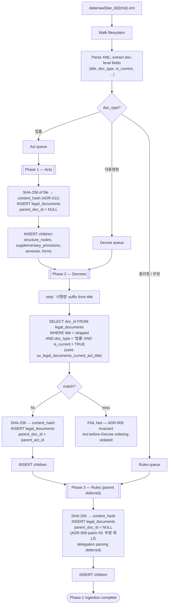

# Session 2026-05-03 — ADR-009 skeleton + Docker stack + idempotent re-ingest + ADR-012 keying

## State at session start

- 11 ADRs accepted; Phase-1 statute schema frozen as
  [migrations/001_statute_tables.sql](../../migrations/001_statute_tables.sql)
  (per ADR-010, 2026-04-29).
- ADR-011 (raw-API-XML retention as filesystem store at
  `data/raw/{law_id}/{mst}.xml`) accepted 2026-05-01; closes the
  ADR-008 soft retention dependency.
- First code in the project landed 2026-05-01:
  [scripts/fetch_law_samples.sh](../../scripts/fetch_law_samples.sh)
  - Phase-1 fetch utility, live-tested end-to-end against the
    법제처 OpenAPI on Fedora.
- `src/`, `tests/` still empty; `scripts/` has the fetch utility.
- Working tree clean; branch in sync with `origin/main` at
  `05f3edb docs(sessions): log 2026-05-01`.
- Open ERD TODOs: TODO-2, TODO-5, TODO-7 (all additive Phase-2
  under the ADR-010 freeze; none blocks ingestion).

## Carried-forward threads (from 2026-05-01 "Next session starting point")

Both threads are now implementation work, not decisions:

1. **ADR-009 population rule implementation** — ingestion-pipeline
   skeleton (Python, per [CLAUDE.md](../../CLAUDE.md) §2 stack).
   Reads from `data/raw/`, writes to `legal_documents` /
   `structure_nodes` / `supplementary_provisions` / `annexes` /
   `forms`. Implements Act-before-Decree ordering and title-pattern
   parent lookup via `ux_legal_documents_current_act_title`.
   Rules-parent assignment deferred per ADR-009 patch #5.
2. **ADR-006 verification trigger** — value-shape check for
   ministry-prefixed `doc_type` variants (e.g., `행정안전부령`).
   Lives inside the ingestion pipeline; first-encounter triggers
   the check.

2026-05-01's recommended shape: pick one (probably ADR-009
population rule), write the minimum ingestion-pipeline skeleton
needed to land it, defer parser depth and full coverage to a
later session.

## Plan

Land the **minimum** ingestion-pipeline skeleton required to exercise
the ADR-009 population rule end-to-end on the Phase-1 corpus
(중대재해처벌법 Act + 시행령). No parser depth, no full coverage —
just the flow that proves Acts insert before Decrees and that the
title-strip parent lookup resolves against
`ux_legal_documents_current_act_title`.

### Skeleton (Mermaid)

### Skeleton scope — what's in / what's deferred

**In scope (minimum to land ADR-009):**
- Filesystem walk over `data/raw/{law_id}/{mst}.xml`
- XML parse → doc-level field extraction (just enough for
  `legal_documents` row: `title`, `doc_type`, `doc_type_code`,
  `is_current`, `promulgation_date`, etc.)
- Three-phase ordering: Acts → Decrees → Rules
- SHA-256 of raw file → `content_hash` (ADR-011 integrity link)
- Title-strip + parent lookup via
  `ux_legal_documents_current_act_title` (ADR-009 patch #2)
- Fail-fast on Decree-without-Act (ADR-009 invariant)
- Rules: `parent_doc_id = NULL` per ADR-009 patch #5

**Out of scope (defer to later sessions):**
- Children-insertion parser depth — `structure_nodes` mapping
  (편/장/절/관/조/항/호/목 → levels 1..8 per ADR-006) shown as a
  single box; actual parser lives behind it
- Chunk generation (`chunks` table) — separate retrieval-pipeline
  concern
- ADR-006 verification trigger for ministry-prefixed `doc_type`
  variants (next session candidate)
- 부령 제1조 delegation-clause parsing for Rules-parent assignment
- Idempotent re-ingest (re-run on existing `content_hash` → skip);
  for now, assume clean DB per run
- Transaction boundaries / batch sizing / progress logging

## Out of scope for today

- ADR-006 verification trigger implementation (separate thread)
- TODO-2 / TODO-5 / TODO-7 (additive Phase-2 under ADR-010 freeze)
- Chunking / embedding / retrieval pipeline
- Any new ADR — today is implementation, not decisions; if a
  decision surfaces, draft an ADR per §5b before acting

---

## What happened

Skeleton landed under [src/ingest/](../../src/ingest/) — the **load layer**,
distinct from the future retrieval engine which will live as a sibling
package under `src/`. Naming follows CLAUDE.md §4's "ingestion-pipeline"
phrasing rather than RAGFlow's "Load" term, since `load` collides with
verb usage and `ingest` is the more common Python convention.

Five files, ~250 LOC total:

- [src/ingest/__init__.py](../../src/ingest/__init__.py) — package
  docstring stating the load-layer role and ADR-009 population rule.
- [src/ingest/records.py](../../src/ingest/records.py) — frozen
  pydantic `Document` model. Carries one row's worth of
  `legal_documents` data plus the source XML path; `parent_doc_id` is
  intentionally absent (resolved by the orchestrator, not the parser).
- [src/ingest/parse.py](../../src/ingest/parse.py) — `discover()` for
  the `data/raw/{law_id}/{mst}.xml` walk, `parse_doc()` for doc-level
  field extraction (`기본정보` block), `sha256_file()` for the ADR-011
  integrity link. Children parsing (조문/부칙/별표/별지서식)
  intentionally absent.
- [src/ingest/populate.py](../../src/ingest/populate.py) — three-phase
  orchestrator (`PHASE_ORDER = ('법률', '대통령령', '총리령', '부령')`),
  `_resolve_parent()` implementing the ADR-009 rule (NULL for Acts;
  title-strip + UNIQUE-INDEX lookup for Decrees with fail-fast on
  miss; NULL for Rules per patch #5), `_insert_legal_document()`
  with the full named-parameter `INSERT … RETURNING doc_id`,
  `_insert_children()` as a documented stub. One transaction per
  phase so Phase N's COMMIT is visible to Phase N+1's parent lookup.
- [src/ingest/__main__.py](../../src/ingest/__main__.py) — `argparse`
  CLI; `python -m ingest --raw-dir data/raw` (with
  `PYTHONPATH=src` until pyproject lands).

**Verification (offline, no DB):**

| Check | Result |
|-------|--------|
| All five files bytecode-compile | OK |
| Parse both real samples in `data/raw/` (Act 228817, Decree 277417) | both parse cleanly; all `legal_documents` NOT-NULL fields populated |
| SHA-256 of raw XML files | computed and surfaced as `content_hash` |
| ADR-009 title-strip resolves against real data | `'중대재해 처벌 등에 관한 법률 시행령'` minus `' 시행령'` = `'중대재해 처벌 등에 관한 법률'` (Act title — exact match) |
| `doc_type_code` extraction (ADR-007) | A0002 for the Act, A0007 for the Decree |

DB-side flow was unverified at this point of the session — see
the Docker layer below.

### Second thread — Docker dev stack (added intra-session)

Two services in [docker-compose.yml](../../docker-compose.yml):

- **`database`** — `pgvector/pgvector:pg16`. Picked over plain
  `postgres:16-alpine` so the dev DB matches the eventual
  chunks/embeddings schema requirement (CLAUDE.md §2 stack); no
  pgvector extension is created today, but having the binary in
  place keeps the dev image stable when chunks land. Migrations
  bind-mounted to `/docker-entrypoint-initdb.d:ro` — applies
  `001_statute_tables.sql` automatically on first boot of an empty
  `pgdata` named volume.
- **`ingest`** — built from
  [docker/ingest.Dockerfile](../../docker/ingest.Dockerfile)
  (python:3.11-slim + `psycopg[binary]` + `pydantic`). Bind-mounts
  `./src/ingest:/app/src/ingest:ro` and `./data/raw:/app/data/raw:ro`
  for dev comfort — code edits on host visible immediately, no
  rebuild. One-shot service (`restart: "no"`).
  `depends_on: database: condition: service_healthy` gates ingest
  on Postgres readiness.

Service named `database` (not `db`) per intra-session correction —
full noun, no abbreviation, matches the codebase's no-abbrev house
style.

Supporting files: [requirements.txt](../../requirements.txt) (loose
major-pin, lock file ships with pyproject), [.dockerignore](../../.dockerignore)
(excludes `data/`, `src/`, etc. since they're bind-mounted, not
baked), [.env.example](../../.env.example) (Postgres + LAW_GO_KR_OC
template).

**End-to-end live verification on Fedora:**

| Step | Result |
|------|--------|
| `docker compose config` | VALID |
| `docker compose up -d database` | pgvector image pulled; container healthy in ~3s after init |
| `001_statute_tables.sql` auto-applied via `initdb.d` | 5 tables, 12 indexes, 4 CHECKs, 5 FKs created |
| `docker compose build ingest` | image 242 MB, no errors |
| `docker compose run --rm ingest` | Phase 법률 → doc_id=1 (parent_doc_id=NULL); Phase 대통령령 → doc_id=2 (parent_doc_id=1) |
| `SELECT … FROM legal_documents` | 2 rows, parent FK populated correctly |

This is the **first end-to-end exercise of the ADR-009 population
rule against a real Postgres instance**, not just an offline
title-strip check. Asymmetric CHECK (`chk_legal_documents_act_no_parent`),
FK (`fk_legal_documents_parent`), and UNIQUE on mst all held under
real INSERTs.

### Hardening passes (intra-session, after first green run)

Two follow-ups based on user-driven critique:

1. **Credentials sourced strictly from `.env`** — defaults removed
   from compose. `${POSTGRES_USER:?…}` form fails compose-config
   render if `.env` doesn't supply them, beats silently passing
   empty creds. Healthcheck switched to `$${VAR}` (escaped) so the
   shell inside the container resolves from its own env rather than
   compose substituting credentials into the rendered config.
2. **Password moved out of the DSN** — first attempt failed with
   `failed to resolve host '@database'` because the URL parser
   choked on a special character in the password. Fix:
   `DATABASE_URL` now carries only `user@host:port/dbname`;
   `PGPASSWORD` is a separate env var that libpq/psycopg read
   automatically when the DSN omits the password. No URL encoding
   required regardless of what the password contains.
3. **`requirements.txt` relocated** to [docker/ingest-requirements.txt](../../docker/ingest-requirements.txt).
   Reasoning: all Python execution is inside Docker, so the file's
   only consumer is `docker/ingest.Dockerfile`'s COPY. Co-located
   with the consumer, leaves room for `docker/retrieval-requirements.txt`
   when that service arrives. Root no longer carries a Python
   manifest.

### Third thread — idempotent re-ingest

First item from the next-session list, pulled forward into the same
session.

`_skip_if_present(conn, doc)` added to
[src/ingest/populate.py](../../src/ingest/populate.py):

- SELECT by `mst` (the natural identity per
  `uk_legal_documents_mst`). Three outcomes:
  - **No row** → return False; caller proceeds with INSERT
    (current Phase-1 behavior).
  - **Row exists, `content_hash` matches** → log `skip … —
    content_hash match`, return True; caller skips INSERT and the
    children flow.
  - **Row exists, `content_hash` differs** → raise
    `ContentMismatchError`. Substantive change (re-published with
    altered metadata, real amendment, etc.) requires the
    amendment-tracking flow which is its own (deferred) decision
    tied to TODO-5; silent overwrite would lose the prior version.
    Loud failure is the right floor here.

ADR not raised: the policy choice — fail-fast on mismatch vs.
auto-supersede — is small enough to justify in code + commentary
rather than a full §5b loop. Auto-supersede is explicitly an open
decision tied to TODO-5; when amendment tracking enters scope, that
ADR will revisit `_skip_if_present`'s third branch.

**Live verification on Fedora (against the same `pgdata` volume
holding the prior run's two rows):**

| Path | Verification | Result |
|------|--------------|--------|
| Skip on match | Re-ran ingest twice against populated DB | both phases logged `skip …`, no INSERT, row count unchanged at 2 |
| Mismatch error | `UPDATE legal_documents SET content_hash='deadbeef' WHERE mst=228817`, re-ran ingest | `ContentMismatchError` raised with `existing=deadbeef…, incoming=11f53a4ed987…`; Phase 1 transaction rolled back; Phase 2 not entered |
| Recovery | Restored real SHA-256 via UPDATE | Re-run returns to skip-on-match cleanly |

The mismatch test exercised the rollback semantics implicitly:
because the error fires inside `with conn.transaction():`, Phase 1
rolls back as a unit. No partial state.

### Fourth thread — ADR-012: structure_nodes keying + sort_key

Pulled forward from the next-session list once idempotent re-ingest
landed. §5b loop ran with two corrections from Seheon mid-draft:

1. **First draft framed branch numbering as deferred.** Seheon's
   pushback ("not deferrable") caught the inflation slip — partial
   evidence (zero-data) presented as a defensible deferral. Empirical
   path: fetch a known-branched statute, decide based on what the
   API actually emits.
2. **Second draft confirmed 조-branches via 형법 (mst=284025)** —
   API encodes 조문가지번호 directly into 조문키 as
   `xxxx{BB}{T}` 7-digit pattern. 49 instances, 가지번호 ∈ {2, 3}.
   Updated §4 from "deferred" to "settled by API encoding."
3. **Seheon then flagged the scope was still wrong.** Per
   *법령의개정방식과폐지방식*, branch numbering applies at 조 AND 호
   — not 조 alone. 형법 happened to have zero 호-branches, which
   masked the gap. Fetched 도로교통법 (mst=281875) — 37
   `<호가지번호>` instances confirmed; structurally distinct from
   조-branches (sibling `<호>` with same `<호번호>` + extra
   `<호가지번호>`, parser composes the key vs. API providing it).
   Zero `<항가지번호>` / `<목가지번호>` / level-1..4 가지번호 in either
   sample. ADR §4 split into 4a (조), 4b (호), 4c (verification
   triggers for any branch element outside 조 / 호).
4. **Tagless rewrite** — Seheon proposed dropping the Korean level
   tags (`항`/`호`/`목`) from `node_key`. Pros (ASCII-only tooling,
   fewer bytes, no level-column redundancy) outweighed cons
   (slightly less self-describing, visual collision with sort_key).
   Accepted. Final `node_key` shape: `{조문키}-{HH}-{NN}{BB}-{KK}`.
5. **Phase-2 follow-up: drop `sort_key` column** — under tagless
   encoding, `sort_key = REPLACE(node_key, '-', '.')` exactly. The
   redundancy is real but ADR-010's freeze blocks destructive change
   in Phase-1. Recorded in ADR-012 §Consequences as a Phase-2
   follow-up (separate ADR at the boundary). Single
   `_compose_keys()` helper in the parser will return
   `(node_key, sort_key)` tuple; Phase-2 ADR collapses to one.

**Empirical anchoring** (every claim traced to a sample):

| Claim | Sample | Evidence |
|-------|--------|----------|
| 조-branches encoded inside 조문키 | 형법 + 도로교통법 | 49 + 49 `<조문가지번호>` instances |
| 호-branches via sibling element | 도로교통법 | 37 `<호가지번호>` instances; max 가지번호=5 |
| No 항/목 branches | both | 0 `<항가지번호>` / 0 `<목가지번호>` |
| Implicit 항 (bare `<항>` no `<항번호>`) | Act §2 | confirmed |

**Side findings worth recording**:

- 법제처 MCP server (`mcp__claude_ai__search_law` etc.) returned
  `NOT_FOUND` for foundational laws including 형법, 민법, 산업안전보건법.
  Fell back to `scripts/fetch_law_samples.sh`. The MCP appears
  broken or misconfigured — not blocking but worth flagging in
  CLAUDE.md §9 if repeated.
- `scripts/fetch_law_samples.sh --search` has a URL-encoding bug
  with non-ASCII queries; direct `curl` with `jq -sRr @uri` worked.
  Small follow-up fix.

**Deliberately not done:**

- No `pyproject.toml` / no dependency pinning yet — kept the commit
  focused on the load-layer code. `psycopg[binary]` and `pydantic`
  will need pinning in a follow-up before any CI step.
- No idempotent re-ingest. Re-running against a populated DB will
  trip `uk_legal_documents_mst`. Acceptable for the skeleton; flag
  for the next-session list.
- No tests. The smoke checks above ran inline; formal pytest
  coverage waits on (a) packaging, (b) a fixture strategy that
  doesn't require Postgres for unit tests.

## Decisions finalized

| ID | Decision | Resolves |
|----|----------|----------|
| ADR-012 | `structure_nodes` keying + `sort_key` format. Tagless ASCII shape `{조문키}-{HH}-{NN}{BB}-{KK}` (ordinal at 항/목, parsed `<호번호>`+`<호가지번호>` at 호; 조문키 verbatim at levels 1–5). Branch numbering scope = 조 + 호 only per *법령의개정방식과폐지방식*. Two verification triggers (조문키 shape + branch-element-at-unaccepted-levels). Phase-2 follow-up to drop redundant `sort_key` column. | Gap left by ADR-002 for sub-조 levels; ERD-draft "Sketch" status of `sort_key`; implicit-항 policy; branch-numbering scope (was wrongly framed as deferred in initial draft) |

## Patterns worth flagging

1. **Multi-pass ADR driven by sample-breadth pushback.** ADR-012 went
   through four scope corrections — deferred → 조-only → 조+호 →
   tagless — each triggered by Seheon catching the inflation slip.
   The first "settled" framing was based on N=1 sample (형법) which
   coincidentally had zero 호-branches; the second sample
   (도로교통법) immediately exposed 37 호-branch instances and a
   structurally-distinct encoding mechanism. Generalization:
   **when an ADR claims "settled by empirical inspection," the
   sample count and the heterogeneity of the corpus matter**. One
   sample is enough to falsify a hypothesis but never enough to
   confirm scope. Single-sample "settled" is the inflation slip in
   disguise. Action for future ADRs of this shape: pull at least
   two structurally-different statutes before flipping to Accepted,
   even if the first sample looks clean.
2. **Phase-2 follow-up vs. premature ADR — the deferral granularity
   question.** ADR-012 §Consequences records "drop sort_key" as a
   recommended Phase-2 follow-up rather than baking the decision
   into ADR-012 itself. The §5b protocol says draft an ADR before
   acting; it does *not* say make every consequent decision now.
   Right granularity: ADR-012 records the *intent* (the redundancy
   exists, the cleanup path is known, the trigger is the Phase-1 →
   Phase-2 boundary); the formal *drop* decision waits for the
   boundary when the full Phase-2 context is available. This is
   different from "deferred-as-hedging" — the intent is committed,
   the ceremonial ADR is just timed correctly.
3. **Verification triggers as an emerging project pattern.** Three
   ADRs now ship defensive assertions that halt ingestion on
   API-contract violations:
   - ADR-006: ministry-prefixed `doc_type` variants
   - ADR-012 §4c.1: 조문키 shape + decoded-fields agreement
   - ADR-012 §4c.2: branch elements at unaccepted levels
   Pattern shape: when an ADR commits to an API-contract assumption
   (e.g., "조문키 always has 7 digits"), it should ship with a
   parser-side assertion. Halt-on-violation, not warn — silent
   absorption of contract drift is worse than loud failure.
   Currently all three live in `src/ingest/parse.py`'s call path
   (one implemented, two waiting on `_insert_children`).
4. **The "data scientist learns the API" pattern took two days.**
   Phase-1 fetch script landed 2026-05-01; first DB-verified ingest
   landed 2026-05-03 along with the realization that branch numbering
   is structurally asymmetric across levels. The XML structure
   wasn't fully understood until parser implementation forced the
   inspection — design alone (ERD draft, ADRs 001–011) didn't
   surface the 호-branch encoding gap. Generalization: **for
   API-driven schema work, parser-implementation work surfaces gaps
   that pure-design review can miss**. Don't over-rely on
   schema-design rounds before the first parser pass; the first
   pass IS a design tool.

## Next session starting point

ADR-009 population rule **landed and DB-verified**, idempotent
re-ingest **landed**, ADR-012 keying convention **accepted**.
Remaining threads, in rough priority order:

1. **`_insert_children` parser depth** — now unblocked by ADR-012.
   `structure_nodes` first (highest-leverage; primary chunk source
   per ADR-005). Implementation: walk the `<조문>` block, derive
   `node_key` per ADR-012 §1, set `parent_id` per the level
   hierarchy, populate `level` / `number` / `title` / `content` /
   `effective_date` / `is_changed` / `content_hash` from XML.
   Then `supplementary_provisions`, `annexes`, `forms` in order.
2. **ADR-012 verification triggers** — defensive `parse_doc`
   assertions: (a) 조문키 shape `^[0-9]{7}$` + decoded fields
   agree with `<조문번호>`/`<조문가지번호>`/`<조문여부>`; (b) no
   `<항가지번호>` / `<목가지번호>` / level-1..4 가지번호 elements.
   Halt on violation. Probably ships alongside thread 1.
3. **Amendment-tracking ADR (ADR-013 placeholder)** — the policy
   deciding what `_skip_if_present`'s mismatch branch should do
   for real amendments. Today: hard fail. Future: auto-supersede
   with `is_current=FALSE` + `superseded_at=NOW()`, then INSERT.
   Tied to TODO-5 + ADR-012 Trade-off §4 (sub-조 key fragility
   across amendments).
4. **Packaging** — `pyproject.toml` with src layout, pinned deps,
   dev deps (`pytest`, `ruff`). Stops needing `PYTHONPATH=src` on
   the host; lock file replaces `docker/ingest-requirements.txt`.
5. **ADR-006 verification trigger** — `parse_doc` currently raises
   on any `doc_type ∉ {법률, 대통령령, 총리령, 부령}`. When the
   first ministry-prefixed variant (e.g., `행정안전부령`) appears,
   decide whether to fold to canonical, store the prefix
   separately, or revisit ADR-006's CHECK shape.
6. **`fetch_law_samples.sh` URL-encoding fix** — `--search` with
   non-ASCII queries fails. Small.
7. **Migration tool selection** — `docker-entrypoint-initdb.d`
   only runs on first boot of an empty volume. Once `002_*.sql`
   ships under the ADR-010 freeze, an evolving DB needs an actual
   migration tool (sqitch / dbmate / Alembic). Not urgent until
   the second migration appears.

**Phase-2 follow-up parking lot** (separate ADRs at the boundary):

- Drop `sort_key` column (ADR-012 §Consequences) — redundant with
  tagless `node_key` under the accepted encoding.
- Phase-2 schema overhaul, if any, decided at the boundary.

## Artefacts produced this session

Code (new):

- [src/ingest/__init__.py](../../src/ingest/__init__.py)
- [src/ingest/__main__.py](../../src/ingest/__main__.py)
- [src/ingest/records.py](../../src/ingest/records.py)
- [src/ingest/parse.py](../../src/ingest/parse.py)
- [src/ingest/populate.py](../../src/ingest/populate.py)

Infrastructure (new):

- [docker-compose.yml](../../docker-compose.yml) — `database` +
  `ingest` services, bind mounts for `src/ingest` / `data/raw` /
  `migrations`, named volume `pgdata` for DB persistence
- [docker/ingest.Dockerfile](../../docker/ingest.Dockerfile) —
  python:3.11-slim base, deps installed, no source COPY (bind-mount
  at runtime)
- [docker/ingest-requirements.txt](../../docker/ingest-requirements.txt)
  — `psycopg[binary]`, `pydantic` (loose major-pin, lock file
  deferred). Co-located with the Dockerfile that consumes it; no
  root-level `requirements.txt` since all Python execution is
  inside Docker
- [.dockerignore](../../.dockerignore)
- [.env.example](../../.env.example)

ADRs (new, Accepted):

- [docs/decisions/ADR-012-structure-nodes-keying-and-sort.md](../decisions/ADR-012-structure-nodes-keying-and-sort.md)
  (multi-pass: deferred → 조-only settled → 조+호 settled →
  tagless rewrite → Phase-2 forward-pointer)

Code (new — earlier today, see prior commits):

- 5 files under `src/ingest/` (ADR-009 walking skeleton)
- `_skip_if_present` + `ContentMismatchError` (idempotent re-ingest)

Sample data fetched (gitignored, per ADR-011):

- `data/raw/001692/284025.xml` — 형법 (조-branch evidence)
- `data/raw/001638/281875.xml` — 도로교통법 (호-branch evidence)
- `docs/api-samples/search-형법.xml`,
  `docs/api-samples/search-도로교통법.xml`

Cross-doc edits:

- `docs/decisions/ADR-002-identifier-strategy.md` — forward-pointer
  to ADR-012 added under Consequences
- `docs/legal-erd-draft.md` — `node_key` / `sort_key` rows refreshed
  with ADR-012 wording; `sort_key` flipped from Sketch → Resolved
- `CLAUDE.md` §4 — bumped ADR range to 001..012; added ADR-012
  bullet; current-phase line updated; last-updated bumped
- `docs/sessions/2026-05-03.md` (this file)
