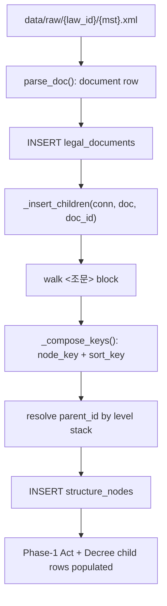

# Session 2026-05-04 — structure_nodes parser depth + ADR-012 verification triggers

## State at session start

- ADR-001 through ADR-012 accepted.
- Phase-1 statute schema frozen as
  [migrations/001_statute_tables.sql](../../migrations/001_statute_tables.sql)
  per ADR-010; future schema changes are additive migrations.
- ADR-009 population rule landed and was DB-verified on 2026-05-03:
  Acts insert before Decrees, Decrees resolve parent Acts by title-strip
  lookup, Rules remain `parent_doc_id = NULL` until first 시행규칙-bearing
  statute enters scope.
- Idempotent re-ingest landed:
  same `mst` + same `content_hash` skips; same `mst` + different
  `content_hash` raises `ContentMismatchError`; ADR-013 keeps that
  same-MST mismatch as a hard data-integrity error.
- ADR-012 accepted:
  `structure_nodes.node_key` uses tagless ASCII format
  `{조문키}-{HH}-{NN}{BB}-{KK}`; `sort_key` is retained for Phase 1 even
  though it is now mechanically derivable.
- Current code surface:
  [src/ingest/](../../src/ingest/) contains the ingestion walking skeleton;
  `_insert_children()` is still a stub.
- Working tree clean at session start; latest commit:
  `d2e8339 docs(sessions): finalize 2026-05-03 log; bump phase-1-progress to v1.2`.

## Carried-forward threads

1. **`_insert_children` parser depth** — highest-priority implementation
   thread. Start with `structure_nodes`, because it is the primary Phase-1
   chunk source per ADR-005 and the first place ADR-012 becomes load-bearing.
2. **ADR-012 verification triggers** — parser-side assertions:
   - `조문키` shape must be `^[0-9]{7}$`
   - decoded `조문키` fields must agree with XML fields such as
     `<조문번호>`, `<조문가지번호>`, and `<조문여부>`
   - branch elements are accepted only at 조 and 호; any
     `<항가지번호>`, `<목가지번호>`, or level-1..4 branch element halts
     ingestion
3. **Packaging** — `pyproject.toml`, pinned runtime/dev dependencies,
   pytest/ruff setup, and host-side execution without `PYTHONPATH=src`.
   Useful before tests get serious, but not required before the parser pass.
4. **Small fetcher fix** — `scripts/fetch_law_samples.sh --search` has a
   non-ASCII URL-encoding bug. Low-risk standalone follow-up.

## Plan

Land the first real child-row insertion path under the ingestion layer:
`legal_documents` already inserts; today should make `structure_nodes`
insert for the Phase-1 Act and Decree samples.

### Target behavior

### In scope

- Parse the `<조문>` block into `structure_nodes`.
- Populate core fields:
  `doc_id`, `parent_id`, `level`, `node_key`, `number`, `title`,
  `content`, `effective_date`, `is_changed`, `sort_key`, `content_hash`.
- Implement ADR-012 key composition in one helper so the later Phase-2
  `sort_key` cleanup has one obvious call site.
- Maintain parent links through a level stack:
  편 → 장 → 절 → 관 → 조 → 항 → 호 → 목.
- Add focused tests or smoke checks around key composition and real-sample
  parsing. Prefer unit coverage that does not require Postgres first; DB
  verification can remain a compose smoke check.
- Run the Docker ingest path against the existing Phase-1 sample corpus if
  environment variables and the local Docker state are available.

### Out of scope for today

- `supplementary_provisions`, `annexes`, and `forms` insertion.
- Chunk generation and retrieval-pipeline code.
- Amendment-tracking policy for `ContentMismatchError` on changed
  `content_hash`.
- Dropping `sort_key` or any destructive Phase-1 schema change.
- ADR-006 ministry-prefixed `doc_type` policy unless a triggering sample
  appears during today's parser work.

## Acceptance checks

| Check | Expected result |
|-------|-----------------|
| Parse existing Phase-1 Act XML | `structure_nodes` records produced for headings/articles/sub-article levels present in the sample |
| Parse existing Phase-1 Decree XML | same, including decree annex references remaining out of scope |
| ADR-012 `node_key` helper | deterministic tagless keys and derivable `sort_key` |
| Parent stack | non-root nodes point to the nearest valid ancestor level |
| Duplicate natural key behavior | no duplicate `(doc_id, node_key)` rows for the sample corpus |
| Existing legal-document ingest | ADR-009 parent linkage and idempotent re-ingest still hold |

## Parking lot

- ADR-013 accepted: amendment tracking / supersession policy tied to
  TODO-5 and `_skip_if_present()` mismatch behavior. Replaces
  `is_current` with `is_head`; legal effectiveness is derived from
  `effective_at` / `superseded_at`.
- ADR-014 accepted: annex ingestion contract for `<별표단위>`, including
  parallel `annex_attachments` / `form_attachments` for HWP/PDF/image
  source provenance and optional application-owned storage paths. No
  `attachment_blobs` layer in Phase 1.
- Migration tool selection before the first `002_*.sql` migration ships.
- Phase-2 ADR: drop redundant `sort_key`.
- TODO-2 and TODO-7 remain additive Phase-2 work.

## What happened

Implemented the first real child-table insertion path:
`structure_nodes` now populate from the `<조문>` block.

Code landed in three places:

- [src/ingest/records.py](../../src/ingest/records.py) — added frozen
  `StructureNode` pydantic model, including parser-only
  `parent_node_key` for deterministic FK resolution before insert.
- [src/ingest/parse.py](../../src/ingest/parse.py) — added
  `parse_structure_nodes(doc)`, ADR-012 key helpers, text/date/hash
  helpers, and ADR-012 verification triggers.
- [src/ingest/populate.py](../../src/ingest/populate.py) —
  `_insert_children()` now inserts `structure_nodes` in parse order,
  resolves `parent_id` from previously returned `node_id`s, and keeps
  부칙/별표/서식 explicitly out of scope.

Parser behavior:

- `조문여부=전문` rows map to level 2 for the Phase-1 corpus.
- `조문여부=조문` rows map to level 5.
- Nested `<항>`, `<호>`, `<목>` map to levels 6, 7, 8.
- Bare `<항>` materializes as an implicit level-6 row:
  `number=''`, `content=''`, key segment `00`.
- `node_key` / `sort_key` follow ADR-012's tagless format.
- `content_hash` is SHA-256 of the node content text.
- `source_url` remains NULL for nodes.

Verification added:

- [tests/test_structure_nodes.py](../../tests/test_structure_nodes.py)
  covers ADR-012 key composition, Phase-1 real-sample counts, duplicate
  `node_key` prevention, and parent-key resolvability.

Checks run:

| Check | Result |
|-------|--------|
| `python -m compileall src/ingest` | OK |
| `PYTHONPATH=src python -m pytest tests/test_structure_nodes.py -q` | 3 passed |
| Phase-1 Act parser count | 102 `structure_nodes` |
| Phase-1 Decree parser count | 138 `structure_nodes` |
| Isolated Docker smoke, first ingest | 2 `legal_documents`, 240 `structure_nodes`, 232 child rows with `parent_id` |
| Isolated Docker smoke, rerun | skipped both docs by `content_hash`; counts unchanged |
| Running Compose `database` service backfill | existing doc_id 1/2 filled with 102 + 138 `structure_nodes` |

Docker note: the smoke used a temporary `/tmp` raw corpus containing only
the Phase-1 Act/Decree files. Running against the whole local `data/raw`
also sees ADR-012 evidence files (`형법`, `도로교통법`); `형법` exposes
duplicate `조문키='0001000'` for multiple `전문` heading rows, which is
outside today's Phase-1 heading assumption and should be handled when
generalizing heading levels beyond 중대재해처벌법.

Actual running dev DB state after the backfill:

| Table / relation | Count |
|------------------|-------|
| `legal_documents` | 2 |
| `structure_nodes` | 240 |
| `structure_nodes.parent_id IS NOT NULL` | 232 |
| level-8 목 rows | 66 |

Document-level counts:

| doc_id | mst | title | parent_doc_id | structure_nodes |
|--------|-----|-------|---------------|-----------------|
| 1 | 228817 | 중대재해 처벌 등에 관한 법률 | NULL | 102 |
| 2 | 277417 | 중대재해 처벌 등에 관한 법률 시행령 | 1 | 138 |

### Follow-up — normalized `structure_nodes.number`

Seheon flagged that `structure_nodes.number` mixed normalized article
numbers (`4`) with raw XML display tokens for 호/목 (`4.`, `가.`).
Corrected the parser and live DB:

- `number` now stores the canonical citation number, not the raw
  punctuation-bearing XML display token.
- 호: `4.` → `4`; future branched 호 uses `7의2` when XML has
  `<호번호>7.</호번호>` + `<호가지번호>2</호가지번호>`.
- 목: `가.` → `가`.
- 조 / heading numbers were already normalized by the API (`4`).
- 항 circled numbers (`①`, `②`, …) remain unchanged; implicit 항 remains
  empty string.
- `content` is untouched, so the original legal text still begins with
  `4.` / `가.` where the API emitted that text.

Live DB update affected 151 rows (`level IN (7, 8)` with trailing-dot
`number`). Verification after update:

| Check | Result |
|-------|--------|
| trailing-dot `number` values by level | 0 at every level |
| total counts | 2 `legal_documents`, 240 `structure_nodes`, 232 rows with `parent_id` |
| sample normalized values | level 5 `4` = 2 rows; level 7 `4` = 14 rows; level 8 `가` = 21 rows |

## Session close

End state:

- Phase-1 `structure_nodes` ingestion is implemented, tested, and backfilled
  into the running Docker Compose `database` service.
- `structure_nodes.number` now stores normalized citation numbers while
  preserving original punctuation-bearing text in `content`.
- ADR-013 is accepted for amendment tracking semantics:
  `is_head` is the latest ingested version; legal effectiveness is derived
  from `effective_at` / `superseded_at`.
- ADR-014 is accepted for annex ingestion and parallel attachment tables:
  `annex_attachments` and `form_attachments` keep source provenance separate
  from optional application-owned storage paths; `attachment_blobs` is
  explicitly deferred for Phase 1.
- The ERD and Phase-1 progress docs now reflect `is_head`, parallel
  attachment tables, and retrieval semantics:
  `annexes -> chunks -> BM25/vector`, `forms -> metadata only`,
  attachments are not indexed directly.

Next action:

1. Implement ADR-014 for `annexes + annex_attachments`.
2. Leave `forms + form_attachments` for a future pass because the Phase-1
   corpus currently has 0 form rows.
3. Add the first additive migration after choosing the migration tool shape.
